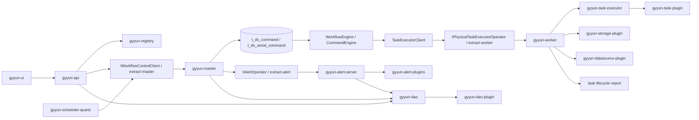
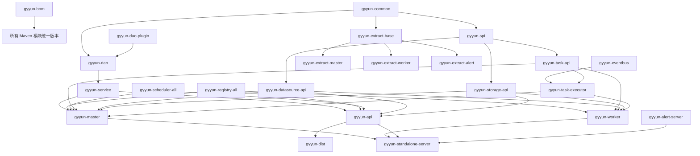
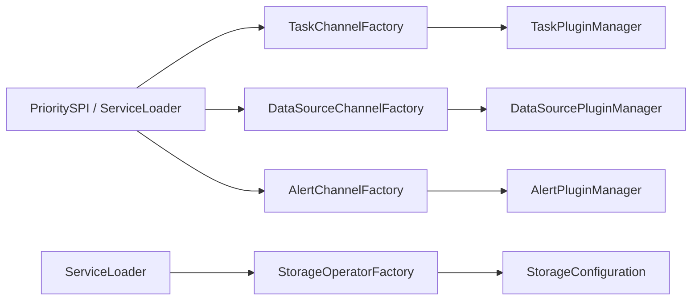

# DolphinScheduler 模块关系

本文档基于当前仓库源码、顶层/子模块 `pom.xml`、后端启动类、RPC 契约、插件加载器、前端路由与服务层代码整理。项目主体是一个 Java 8 + Spring Boot 2.6.1 + Maven 多模块工程，前端是 Vue 3 + Vite + Naive UI，核心目标是提供可视化 DAG 工作流调度、分布式 Master/Worker 执行、告警、资源管理、数据源插件和任务插件体系。

## 1. 总体结构

顶层 `pom.xml` 聚合了 26 个主模块：

```text
gyyun-bom
gyyun-alert
gyyun-spi
gyyun-registry
gyyun-task-plugin
gyyun-common
gyyun-api
gyyun-yarn-aop
gyyun-dao
gyyun-dist
gyyun-service
gyyun-microbench
gyyun-standalone-server
gyyun-datasource-plugin
gyyun-meter
gyyun-master
gyyun-worker
gyyun-tools
gyyun-ui
gyyun-scheduler-plugin
gyyun-storage-plugin
gyyun-extract
gyyun-dao-plugin
gyyun-authentication
gyyun-eventbus
gyyun-task-executor
```

仓库中还保留了未纳入顶层聚合的测试聚合模块：`gyyun-e2e`、`gyyun-api-test`。

整体可以分成 8 层：

| 层级 | 模块 | 职责 |
| --- | --- | --- |
| 前端入口 | `gyyun-ui` | Vue 控制台，调用 API Server |
| API 控制面 | `gyyun-api` | REST 接口、鉴权、参数校验、执行/资源/项目/安全管理 |
| 调度执行面 | `gyyun-master`、`gyyun-worker`、`gyyun-task-executor` | Master 消费命令并推进 DAG，Worker 执行物理任务，task-executor 提供通用任务执行引擎 |
| 告警面 | `gyyun-alert` | Alert Server、告警插件发现和告警发送 |
| 领域共享层 | `gyyun-common`、`gyyun-dao`、`gyyun-service`、`gyyun-spi` | 常量/工具/生命周期、数据库访问、领域服务、插件 SPI |
| 分布式基础设施 | `gyyun-registry`、`gyyun-extract`、`gyyun-scheduler-plugin`、`gyyun-eventbus`、`gyyun-meter` | 注册中心/HA、Netty RPC、Quartz 调度、事件总线、指标 |
| 插件体系 | `gyyun-task-plugin`、`gyyun-datasource-plugin`、`gyyun-storage-plugin`、`gyyun-dao-plugin`、`gyyun-authentication` | 任务、数据源、存储、数据库方言、认证/云凭证扩展 |
| 交付与测试 | `gyyun-dist`、`gyyun-tools`、`gyyun-standalone-server`、`gyyun-yarn-aop`、`gyyun-e2e`、`gyyun-api-test`、`gyyun-microbench` | 安装包、升级迁移工具、单机入口、YARN 切面、端到端/API/性能测试 |

## 2. 核心调用链



典型手动启动工作流流程：

1. 前端页面通过 `gyyun-ui/src/service/modules/*` 调用 API。
2. `ExecutorController` 进入 `ExecutorServiceImpl`，完成项目权限、工作流上线状态、参数等校验。
3. `ExecutorClient` 通过 `RegistryClient` 选择一个 Master 节点。
4. API 使用 `extract-base` 的 `Clients.withService(IWorkflowControlClient.class).withHost(...)` 远程调用 Master。
5. Master 侧 `WorkflowControlClient` 委托 `WorkflowManualTrigger` 创建 `WorkflowInstance` 和 `Command`。
6. `CommandEngine` 轮询 `t_ds_command`，`WorkflowExecutionFactory` 按 `CommandType` 选择 `ICommandHandler`，创建 `WorkflowExecution`。
7. Master 的工作流事件总线推进 DAG 状态，普通物理任务通过 `TaskExecutorClient` 分发给 Worker。
8. Worker 的 `PhysicalTaskEngineDelegator` 创建 `PhysicalTaskExecutor`，加载具体 `TaskChannel`，执行 `AbstractTask`。
9. Worker 把任务生命周期事件回报 Master；Master 更新实例状态、触发后继任务或收尾告警。

定时调度流程：

1. API 的 `SchedulerServiceImpl` 管理 `Schedule` 数据并调用 `SchedulerApi`。
2. `gyyun-scheduler-quartz` 注册 Quartz Job。
3. `ProcessScheduleTask` 到点后构造 `WorkflowScheduleTriggerRequest`，调用 Master 的 `IWorkflowControlClient.scheduleTriggerWorkflow`。
4. 后续进入同一套 `WorkflowTrigger -> Command -> WorkflowEngine` 链路。

告警流程：

1. Master 或 Service 组装告警内容。
2. 通过 `extract-alert` 的 `IAlertOperator` 调用 Alert Server。
3. `AlertOperatorImpl` 调用 `AlertSender`。
4. `AlertPluginManager` 根据 DB 中的插件实例和 SPI 加载的 `AlertChannel` 发送邮件、钉钉、飞书、Slack 等告警。

## 3. 编译依赖主图



## 4. 主模块说明

| 模块 | 功能 | 主要依赖 | 被谁使用/关联 |
| --- | --- | --- | --- |
| `gyyun-bom` | 统一第三方依赖版本，管理 Spring、MyBatis、Netty、Quartz、Hadoop、AWS、测试依赖等版本。 | 无业务依赖 | 几乎所有 Maven 模块通过 dependencyManagement 引入 |
| `gyyun-common` | 通用常量、枚举、异常、线程、生命周期、DAG 工具、HTTP/JSON/日期/文件工具、远程日志模型、SQL 脚本解析。 | `gyyun-aws-authentication` | API、Master、Worker、DAO、Service、插件和 Registry 的基础包 |
| `gyyun-spi` | 插件 SPI 基础，包括 `PrioritySPI`、`PrioritySPIFactory`、参数元数据、数据源基础接口。 | `common` | task/datasource/storage/alert 插件体系共同依赖 |
| `gyyun-dao-plugin` | 数据库类型插件，提供 H2/MySQL/PostgreSQL 的 MyBatis `DbType`、方言、数据库监控。 | Spring Boot autoconfigure、MyBatis Plus | `gyyun-dao` 启动时注入 `DaoPluginConfiguration` |
| `gyyun-dao` | 数据访问层，包含 63 个 entity、44 个 mapper、34 个 repository、SQL 初始化脚本。 | `common`、`task-api`、`dao-plugin-all` | API、Master、Alert、Service、Scheduler、Tools 使用 |
| `gyyun-service` | 领域服务层，封装命令创建、工作流定义/实例处理、DAG 辅助、Cron、参数固化、告警内容等跨模块逻辑。 | `dao`、`spi`、`registry-api`、`task-api`、`extract-master/worker` | API、Master、Scheduler 复用 |
| `gyyun-extract` | 进程间 RPC 契约和 Netty RPC 框架。`extract-base` 提供动态代理客户端和 Spring 服务端发现，`extract-master/worker/alert` 定义各服务接口与 DTO。 | `common`、`meter`、`task-api`、`task-executor` | API、Master、Worker、Alert、Scheduler 之间的远程调用边界 |
| `gyyun-eventbus` | 通用事件总线基础。 | 无内部依赖 | `task-executor`、Master/Worker 的生命周期事件流 |
| `gyyun-task-executor` | 通用任务执行引擎，定义 `ITaskEngine`、`ITaskExecutor`、任务容器、任务生命周期事件和状态机。 | `eventbus`、`task-api`、`common` | Worker 的物理任务执行、Master 的逻辑任务执行都复用 |
| `gyyun-registry` | 注册中心 API、HA 选主、服务发现和锁；实现包括 Zookeeper、JDBC、Etcd。 | `common`、`extract-base` | API 查找 Master，Master/Worker/Alert 注册服务、监听集群和 HA |
| `gyyun-scheduler-plugin` | 调度器插件。当前核心实现是 Quartz，负责计划任务注册、删除和触发。 | `scheduler-api`、`service`、`meter`、`extract-master`、Quartz | API 管理调度，Master 启动 `SchedulerApi` 并执行 Quartz Job |
| `gyyun-meter` | Spring Boot Actuator、Micrometer、Prometheus 指标封装。 | `common` | API/Master/Worker/Alert 指标和健康检查 |
| `gyyun-api` | API Server，提供 REST 控制器、登录鉴权、项目/资源/工作流/任务/数据源/安全/监控接口，加载任务和数据源插件供校验与 UI 展示。 | `service`、`dao`、`meter`、`common`、`spi`、`registry-all`、`scheduler-all`、`task-api/all`、`datasource-api/all`、`storage-api/all`、`extract-*`、`ui` | 前端唯一后端入口；通过 Registry + Extract 调用 Master/Worker/Alert |
| `gyyun-master` | Master Server，负责命令消费、工作流实例状态机、DAG 拓扑、任务分发、逻辑任务执行、Worker 负载均衡、故障转移、集群监听、Quartz 调度。 | `common`、`meter`、`service`、`spi`、`registry-all`、`scheduler-all`、`datasource-api/all`、`task-api/all`、`storage-api/all`、`extract-master/worker`、`eventbus`、`task-executor` | API/Quartz 通过 RPC 触发；Worker 通过 RPC 回报任务事件 |
| `gyyun-worker` | Worker Server，注册 Worker 节点，启动 RPC，执行物理任务，下载资源，管理租户工作目录，回报任务生命周期。 | `common`、`meter`、`registry-all`、`task-api/all`、`datasource-api/all`、`storage-api/all`、`extract-*`、`eventbus`、`task-executor`、`yarn-aop` | Master 分发任务给 Worker；任务插件运行在 Worker |
| `gyyun-alert` | 告警聚合模块，包含 Alert Server、Alert API 和多个告警插件。 | `meter`、`spi`、`alert-api/all`、`dao`、`registry-all`、`extract-alert`、`common` | Master/API/Service 通过 `IAlertOperator` 发送告警 |
| `gyyun-task-plugin` | 任务插件聚合。`task-api` 定义 `TaskChannelFactory`、`TaskChannel`、`AbstractTask`、任务参数、Shell/Yarn/K8s 基础能力；各子模块实现具体任务类型。 | `task-api`、`common`，部分插件依赖 `datasource-api/all` 或 AWS 认证 | API 校验任务参数，Master 识别逻辑任务，Worker 执行物理任务 |
| `gyyun-datasource-plugin` | 数据源插件聚合。`datasource-api` 管理 `DataSourceProcessor` 和 `DataSourceChannel`；各子模块实现具体数据库/云服务连接。 | `spi`、`datasource-api`、`common` | API 数据源管理、SQL/数据集成类任务、Worker 执行阶段使用 |
| `gyyun-storage-plugin` | 资源存储插件聚合。`storage-api` 定义 `StorageOperator`，实现本地、HDFS、S3、OSS、GCS、ABS、OBS、COS 等。 | `spi`、`storage-api`、`common`，部分依赖 `datasource-api` 或 AWS 认证 | API 资源管理、Worker 下载资源、Tools 迁移资源 |
| `gyyun-authentication` | 认证/凭证扩展。`actuator-authentication` 保护管理端点，`aws-authentication` 创建 AWS 客户端和凭证 Provider。 | Spring Security、AWS SDK | common、storage-s3、AWS/EMR/SageMaker/DataSync/DMS 任务插件使用 |
| `gyyun-standalone-server` | 单机启动入口，依赖 Master、Worker、API、Alert 和插件 all 包，适合本地或单机部署。 | `master`、`worker`、`api`、`alert-server`、`alert-all`、`task-all`、`datasource-all`、`storage-all` | 交付包和本地运行 |
| `gyyun-ui` | Vue 3 前端控制台，路由覆盖首页、项目、工作流、任务、资源、数据源、安全、监控、UI 设置等；Axios 统一加 `sessionId` 与语言头。 | 前端依赖 Vue、Pinia、Vue Router、Axios、Naive UI、X6、D3、ECharts、Monaco | 打包后由 API/Dist 提供静态资源 |
| `gyyun-tools` | 运维工具，包括数据库 schema 初始化/升级、资源迁移、血缘迁移。 | `dao`、`storage-all` | Dist 安装包和运维脚本 |
| `gyyun-dist` | 二进制/source 包和 Docker 构建脚本的 assembly 模块。 | `standalone-server`、`api`、`alert-server`、`ui`、`tools` | 发布产物 |
| `gyyun-yarn-aop` | AspectJ 切面，围绕 Hadoop YARN Client 做增强。 | AspectJ、Hadoop Yarn Client | Worker 和部分 Yarn 类任务 |
| `gyyun-microbench` | JMH 性能测试，当前主要覆盖 RPC 基准。 | `extract-base`、JMH | 性能回归/实验 |
| `gyyun-api-test` | API 自动化测试聚合，包含测试核心与用例。 | JUnit、Testcontainers、`api`、`dao` | API 回归测试 |
| `gyyun-e2e` | Selenium/Testcontainers 端到端 UI 测试，包含页面对象、用例和 Docker 场景。 | Selenium、JUnit、Testcontainers | UI/端到端回归测试 |

## 5. 核心后端模块内部结构

### 5.1 `gyyun-api`

主要包：

| 包 | 功能 |
| --- | --- |
| `controller` | REST 接口，按业务域拆分，如 `WorkflowDefinitionController`、`ExecutorController`、`ResourcesController`、`DataSourceController`、`UsersController` 等 |
| `service` / `service.impl` | API 层应用服务，做权限、参数、状态校验，并调用 DAO、Service 或 Extract 客户端 |
| `executor.workflow` | 工作流执行委托，选择 Master 并调用 `IWorkflowControlClient` |
| `executor.logging` | 本地/远程日志读取代理 |
| `security` / `interceptor` | 登录态、LDAP/OIDC/Casdoor、拦截器、限流 |
| `audit` | 操作审计切面和审计记录 |
| `configuration` | API 配置、OpenAPI、动态任务类型、OAuth2 等 |
| `dto` / `vo` / `validator` | 请求/响应模型和校验器 |
| `k8s`、`python` | K8s namespace 管理、Python Gateway |

启动类 `ApiApplicationServer` 导入 `DaoConfiguration`、`CommonConfiguration`、`ServiceConfiguration`、`StorageConfiguration`、`RegistryConfiguration`，应用就绪后加载 `DataSourcePluginManager` 和 `TaskPluginManager`。

### 5.2 `gyyun-master`

主要包：

| 包 | 功能 |
| --- | --- |
| `engine.command` | `CommandEngine` 轮询命令表，`ICommandHandler` 按命令类型构造工作流执行上下文 |
| `engine.workflow` | 工作流执行、生命周期事件、状态机、失败策略、串行工作流协调、触发器 |
| `engine.task` | 任务实例构造、任务生命周期、任务状态机、任务分发、执行器客户端 |
| `engine.graph` | 工作流 DAG 拓扑、执行图和拓扑访问 |
| `engine.executor` | Master 内部逻辑任务执行器，处理 dependent、condition、switch、sub-workflow 等逻辑任务 |
| `cluster` | Master/Worker 集群信息、负载均衡、订阅 Registry 节点变化 |
| `registry` | Master 注册、心跳和连接状态监听 |
| `rpc` | Master RPC 服务端及 `IWorkflowControlClient` 实现 |
| `failover` | Master/Worker 故障转移协调 |
| `metrics`、`config` | Master 指标和配置 |

启动类 `MasterServer` 的关键顺序是：启动 RPC、加载任务/数据源插件、注册 Master、启动 HA 协调器、集群监听、WorkflowEngine、SchedulerApi、系统事件总线。

### 5.3 `gyyun-worker`

主要包：

| 包 | 功能 |
| --- | --- |
| `executor` | `PhysicalTaskEngineDelegator`、`PhysicalTaskExecutor`、物理任务插件工厂、生命周期事件回报 |
| `rpc` | Worker RPC 服务端，提供任务分发、暂停、终止、查询日志、流式任务操作 |
| `registry` | Worker 注册、心跳和连接状态监听 |
| `task` | Worker 心跳任务 |
| `utils` | 任务执行上下文、租户目录、工作目录、资源下载辅助 |
| `config`、`metrics` | Worker 配置、负载保护、指标和健康检查 |

启动类 `WorkerServer` 的关键顺序是：启动 RPC、加载任务插件、加载数据源插件、注册 Worker、启动物理任务执行引擎。

### 5.4 `gyyun-alert`

主要组成：

| 子模块/包 | 功能 |
| --- | --- |
| `gyyun-alert-server` | Alert Server 入口、RPC、HA、插件管理、事件队列、告警发送线程池 |
| `gyyun-alert-api` | `AlertChannelFactory`、`AlertChannel`、告警参数和返回模型 |
| `gyyun-alert-all` | 汇总所有告警插件 |
| `gyyun-alert-*` | 邮件、企业微信、钉钉、飞书、HTTP、脚本、Slack、PagerDuty、Webex、Telegram、Prometheus、阿里云语音等具体实现 |

`AlertServer` 启动后先加载告警插件并写入/更新 `t_ds_plugin_define`，再启动 RPC 和 Registry。`AlertHAServer` 选主成功后才启动告警消费循环，避免多节点重复消费。

## 6. 插件模块关系

### 6.1 统一 SPI 机制

任务、数据源、告警、存储插件都依赖 Java `ServiceLoader`。其中任务、数据源 Channel、告警插件使用 `PrioritySPIFactory`，当 SPI 名称冲突时按 priority 选择高优先级实现。



### 6.2 任务插件

`gyyun-task-api` 定义：

| 类型 | 说明 |
| --- | --- |
| `TaskChannelFactory` | 任务插件工厂，提供插件名称和 `TaskChannel` |
| `TaskChannel` | 创建具体 `AbstractTask`，解析任务参数 |
| `AbstractTask` | 物理任务执行接口，定义 `handle`、`cancel`、`getParameters` |
| `AbstractRemoteTask` / `AbstractYarnTask` | 远程任务、YARN 任务基础能力 |
| 参数模型 | Shell、SQL、Dependent、Condition、Switch、SubWorkflow、K8s 等参数 |
| 工具类 | 全局参数、占位符、变量池、Shell 拦截器、YARN/K8s 工具 |

任务插件子模块：

| 子模块 | 功能/任务类型 | 特殊依赖 |
| --- | --- | --- |
| `gyyun-task-shell` | Shell 脚本任务 | `task-api`、`common` |
| `gyyun-task-python` | Python 任务 | `task-api`、`common` |
| `gyyun-task-sql` | SQL 任务 | `datasource-api` |
| `gyyun-task-procedure` | 存储过程任务 | `datasource-api` |
| `gyyun-task-datax` | DataX 数据同步 | `datasource-api` |
| `gyyun-task-sqoop` | Sqoop 任务 | `datasource-api` |
| `gyyun-task-flink` | Flink 批任务 | `task-api` |
| `gyyun-task-flink-stream` | Flink Stream 任务 | 依赖 `task-flink` |
| `gyyun-task-spark` | Spark 任务 | `task-api` |
| `gyyun-task-mr` | MapReduce 任务 | `task-api` |
| `gyyun-task-http` | HTTP 任务 | `task-api` |
| `gyyun-task-grpc` | gRPC 任务 | `task-api` |
| `gyyun-task-java` | Java 任务 | `task-api` |
| `gyyun-task-k8s` | Kubernetes 任务 | `datasource-k8s` |
| `gyyun-task-kubeflow` | Kubeflow 任务 | `datasource-api` |
| `gyyun-task-zeppelin` | Zeppelin 任务 | `datasource-zeppelin` |
| `gyyun-task-jupyter` | Jupyter 任务 | `task-api` |
| `gyyun-task-mlflow` | MLflow 任务 | `task-api` |
| `gyyun-task-openmldb` | OpenMLDB 任务 | 依赖 `task-python` |
| `gyyun-task-dvc` | DVC 任务 | `task-api` |
| `gyyun-task-dinky` | Dinky 任务 | `task-api` |
| `gyyun-task-sagemaker` | AWS SageMaker 任务 | `datasource-sagemaker`、AWS 认证 |
| `gyyun-task-emr` | AWS EMR 任务 | AWS 认证 |
| `gyyun-task-emr-serverless` | AWS EMR Serverless 任务 | AWS 认证 |
| `gyyun-task-dms` | AWS DMS 任务 | AWS 认证 |
| `gyyun-task-datasync` | AWS DataSync 任务 | AWS 认证 |
| `gyyun-task-chunjun` | ChunJun 同步任务 | `datasource-api` |
| `gyyun-task-hivecli` | Hive CLI 任务 | `task-api` |
| `gyyun-task-seatunnel` | SeaTunnel 任务 | `task-api` |
| `gyyun-task-linkis` | Linkis 任务 | `task-api` |
| `gyyun-task-datafactory` | Azure Data Factory 任务 | `task-api` |
| `gyyun-task-remoteshell` | 远程 Shell 任务 | `datasource-ssh` |
| `gyyun-task-aliyunserverlessspark` | 阿里云 Serverless Spark 任务 | `datasource-all`、`datasource-api` |
| `gyyun-task-all` | 汇总所有任务插件 | 被 API/Master/Worker/Standalone 作为插件集合引入 |

逻辑任务 `Dependent`、`Conditions`、`Switch`、`SubWorkflow` 的 `TaskChannelFactory` 位于 `task-api`，但实际执行在 Master 的 `engine.executor.plugin` 中完成；普通物理任务在 Worker 执行。

### 6.3 数据源插件

`gyyun-datasource-api` 定义两类扩展：

| 类型 | 说明 |
| --- | --- |
| `DataSourceChannelFactory` / `DataSourceChannel` | 创建 AdHoc 或 Pooled 数据源客户端 |
| `DataSourceProcessor` | 参数 DTO、连接参数、UI 表单参数、连接测试等处理 |

数据源子模块：

| 子模块 | 数据源 |
| --- | --- |
| `gyyun-datasource-mysql` | MySQL |
| `gyyun-datasource-postgresql` | PostgreSQL |
| `gyyun-datasource-sqlserver` | SQL Server |
| `gyyun-datasource-oracle` | Oracle |
| `gyyun-datasource-clickhouse` | ClickHouse |
| `gyyun-datasource-db2` | DB2 |
| `gyyun-datasource-hive` | Hive |
| `gyyun-datasource-spark` | Spark，依赖 Hive 数据源 |
| `gyyun-datasource-presto` | Presto |
| `gyyun-datasource-trino` | Trino |
| `gyyun-datasource-redshift` | Redshift |
| `gyyun-datasource-athena` | Athena |
| `gyyun-datasource-kyuubi` | Kyuubi |
| `gyyun-datasource-starrocks` | StarRocks |
| `gyyun-datasource-azure-sql` | Azure SQL |
| `gyyun-datasource-dameng` | 达梦 |
| `gyyun-datasource-oceanbase` | OceanBase |
| `gyyun-datasource-databend` | Databend |
| `gyyun-datasource-snowflake` | Snowflake |
| `gyyun-datasource-vertica` | Vertica |
| `gyyun-datasource-doris` | Doris |
| `gyyun-datasource-hana` | SAP HANA |
| `gyyun-datasource-dolphindb` | DolphinDB |
| `gyyun-datasource-ssh` | SSH 连接 |
| `gyyun-datasource-zeppelin` | Zeppelin |
| `gyyun-datasource-k8s` | Kubernetes |
| `gyyun-datasource-sagemaker` | SageMaker |
| `gyyun-datasource-aliyunserverlessspark` | 阿里云 Serverless Spark |
| `gyyun-datasource-all` | 汇总所有数据源插件 |

### 6.4 存储插件

`gyyun-storage-api` 定义 `StorageOperator`，对目录、文件、上传、下载、列表、资源元数据统一抽象。`StorageConfiguration` 根据 `resource.storage.type` 用 `ServiceLoader<StorageOperatorFactory>` 选择具体实现。

| 子模块 | 存储类型 |
| --- | --- |
| `gyyun-storage-api` | API 和本地存储实现 |
| `gyyun-storage-hdfs` | HDFS |
| `gyyun-storage-s3` | S3，依赖 AWS 认证 |
| `gyyun-storage-oss` | 阿里云 OSS |
| `gyyun-storage-gcs` | Google Cloud Storage |
| `gyyun-storage-abs` | Azure Blob Storage |
| `gyyun-storage-obs` | 华为 OBS |
| `gyyun-storage-cos` | 腾讯 COS |
| `gyyun-storage-all` | 汇总所有存储插件 |

## 7. 基础设施模块关系

### 7.1 Registry

`gyyun-registry-api` 提供：

| 接口/类 | 功能 |
| --- | --- |
| `Registry` | 节点增删查、订阅、锁、连接状态等统一接口 |
| `RegistryClient` | 对 `Registry` 的客户端封装 |
| `AbstractHAServer` | 基于 Registry path 的 HA 选主 |
| `RegistryNodeType` | Master、Worker、Alert、Coordinator 等节点类型 |

实现模块：

| 子模块 | 实现 |
| --- | --- |
| `gyyun-registry-zookeeper` | Zookeeper 注册中心 |
| `gyyun-registry-jdbc` | JDBC 注册中心 |
| `gyyun-registry-etcd` | Etcd 注册中心 |
| `gyyun-registry-all` | 汇总实现 |
| `gyyun-registry-it` | Registry 集成测试支撑 |

Master、Worker、Alert 使用 Registry 注册自身和心跳；API 使用 Registry 随机选择 Master；Master 使用 Registry 监听 WorkerGroup 和 HA 事件。

### 7.2 Extract RPC

| 子模块 | 功能 |
| --- | --- |
| `gyyun-extract-base` | RPC 注解、动态代理客户端、Netty client/server、序列化、Future、指标 |
| `gyyun-extract-common` | 通用 RPC DTO 和日志服务契约 |
| `gyyun-extract-master` | Master 控制接口，如工作流触发、暂停、停止、查询、任务事件监听 |
| `gyyun-extract-worker` | Worker 任务执行接口，如派发、暂停、终止、查询任务、流式任务操作 |
| `gyyun-extract-alert` | Alert 发送接口 |

服务端通过 `SpringServerMethodInvokerDiscovery` 扫描 Spring Bean，客户端通过 `Clients.withService(...).withHost(...)` 创建接口代理。

### 7.3 Scheduler

| 子模块 | 功能 |
| --- | --- |
| `gyyun-scheduler-api` | `SchedulerApi` 契约 |
| `gyyun-scheduler-quartz` | Quartz 实现、Quartz 数据源配置、Job/Trigger 构造、`ProcessScheduleTask` |
| `gyyun-scheduler-all` | 汇总 Scheduler 实现 |

Quartz Job 在 Master 进程内运行，触发时调用本地 Spring Bean `IWorkflowControlClient`，进入 Master 的工作流触发逻辑。

## 8. 前端模块关系

`gyyun-ui` 是独立前端工程：

| 目录 | 功能 |
| --- | --- |
| `src/router` | Vue Router 路由，拆为 projects、resources、datasource、security、monitor、ui-setting 等模块 |
| `src/service` | Axios 封装和 API 模块。统一 baseURL 为 `/gyyun`，请求头携带 `sessionId` 和 `language` |
| `src/store` | Pinia 状态：用户、项目、任务类型、动态 DAG、文件、路由、主题、时区、UI 设置 |
| `src/views` | 页面：登录、首页、项目、工作流、任务、资源、数据源、安全、监控、用户资料等 |
| `src/components` | 通用组件：表单、弹窗、卡片、Cron、图表、日志弹窗、Monaco 编辑器 |
| `src/locales` | 中英文文案 |
| `src/assets` / `themes` | 图片、样式、主题 |

前端到后端的关系是：

```text
view/component -> service/modules/* -> axios service -> API controller -> API service -> DAO / Extract RPC
```

其中工作流 DAG 画布使用 `@antv/x6`，图表使用 `echarts`，关系/树图使用 `d3`，代码编辑使用 `monaco-editor`。

## 9. 交付、工具与测试模块

| 模块 | 功能 | 关联 |
| --- | --- | --- |
| `gyyun-dist` | Maven assembly、插件 assembly、Docker build/push 脚本 | 汇总 API、Alert、UI、Tools、Standalone |
| `gyyun-tools` | `upgrade-schema.sh`、`migrate-resource.sh`、`migrate-lineage.sh` 和对应 Java 入口 | 依赖 DAO 和 Storage，用于升级/迁移 |
| `gyyun-standalone-server` | 单机 Spring Boot 入口 | 把 Master、Worker、API、Alert 和插件集合放到一个进程/包里 |
| `gyyun-yarn-aop` | Yarn Client AspectJ 切面 | Worker 和 YARN 类任务关联 |
| `gyyun-microbench` | JMH 基准测试 | 当前主要围绕 Extract RPC |
| `gyyun-api-test` | API 自动化测试框架和用例 | 使用 Testcontainers、JUnit，覆盖项目/租户/调度/工作流/任务 API |
| `gyyun-e2e` | UI 端到端测试 | Selenium + Testcontainers，页面对象覆盖登录、项目、资源、安全、数据源、工作流任务 |
| `deploy` | Docker Compose、Kubernetes Helm Chart 等部署文件 | 消费 dist 产物或镜像 |
| `docs` | 官方文档站点配置、图片和辅助脚本 | 文档资产，不参与运行时 |

## 10. 关键依赖方向总结

### 10.1 共享层依赖

```text
common <- spi <- task-api / datasource-api / storage-api / alert-api
common <- dao-plugin <- dao <- service
common <- extract-base <- extract-master / extract-worker / extract-alert
eventbus + task-api + common -> task-executor
```

### 10.2 服务进程依赖

```text
api -> service + dao + registry-all + scheduler-all + extract-* + plugin api/all + ui
master -> service + dao + registry-all + scheduler-all + extract-master/worker + task-executor + plugin api/all
worker -> registry-all + extract-* + task-executor + task/datasource/storage api/all
alert-server -> dao + registry-all + extract-alert + alert-api/all
standalone -> master + worker + api + alert-server + plugin all
```

### 10.3 插件集合依赖

```text
task-all -> all task-* plugins
datasource-all -> all datasource-* plugins
storage-all -> all storage-* plugins
alert-all -> all alert-* plugins
dao-plugin-all -> h2 + mysql + postgresql dao plugins
registry-all -> zookeeper + jdbc + etcd registry plugins
scheduler-all -> scheduler-api + scheduler-quartz
```

### 10.4 运行时协作关系

| 发起方 | 依赖/调用 | 目标 | 目的 |
| --- | --- | --- | --- |
| UI | HTTP | API | 页面数据、操作提交 |
| API | DAO/Service | DB/领域服务 | 权限、元数据、参数校验 |
| API | Registry | Master 列表 | 选择可用 Master |
| API | Extract RPC | Master | 手动启动、补数、暂停、停止、恢复工作流 |
| Master | DAO | DB | 命令、工作流实例、任务实例、调度元数据 |
| Master | Registry | Registry 实现 | 注册、HA、监听 Worker/Master |
| Master | Extract RPC | Worker | 派发、暂停、终止、接管任务 |
| Worker | Extract RPC | Master | 回报任务生命周期、运行状态变化 |
| Worker | Task Plugin | 具体任务 | 执行 Shell/SQL/Spark/Flink/HTTP 等任务 |
| Worker | Storage Plugin | 存储系统 | 下载资源、管理任务工作目录 |
| API/Worker | Datasource Plugin | 数据源 | 连接测试、SQL 执行、任务运行 |
| Master/Service | Extract RPC | Alert | 发送工作流/任务告警 |
| Alert | Alert Plugin | 外部通知系统 | 邮件、IM、Webhook、脚本等 |
| Tools | DAO/Storage | DB/资源存储 | 初始化、升级、迁移 |

## 11. 建议阅读顺序

如果后续要继续深入源码，推荐按下面顺序读：

1. `gyyun-api/src/main/java/com/gyyun/ds/api/ApiApplicationServer.java`
2. `gyyun-master/src/main/java/com/gyyun/ds/server/master/MasterServer.java`
3. `gyyun-worker/src/main/java/com/gyyun/ds/server/worker/WorkerServer.java`
4. `gyyun-extract/gyyun-extract-base` 和 `extract-master/worker/alert` 的接口
5. `gyyun-master/.../engine/command/CommandEngine.java`
6. `gyyun-master/.../engine/workflow` 和 `engine/task`
7. `gyyun-worker/.../executor/PhysicalTaskExecutor.java`
8. `gyyun-task-plugin/gyyun-task-api`
9. `gyyun-dao`、`gyyun-service`
10. `gyyun-ui/src/router`、`src/service/modules`、`src/views/projects/workflow`

这条路径正好覆盖从前端操作到 Master 调度、Worker 执行、插件加载、状态回报和数据库落库的主链路。
