# 3-架构模式

本文基于当前项目源码，整理 DolphinScheduler 在前端和后端分别采用的主要架构模式，以及这些模式在项目目录、模块依赖和运行链路中的体现。

## 1. 总体架构结论

当前项目可以概括为：

```text
前端：Vue 3 单页应用 SPA + 组件化架构 + Composition API 业务 Hook + Pinia 状态管理 + API Client 层
后端：多进程分布式 Master-Worker 架构 + Spring 分层架构 + 事件驱动工作流引擎 + SPI 插件架构
```

需要特别注意的是，后端虽然拆成了 API、Master、Worker、Alert、插件、注册中心等多个 Maven 模块和多个可独立启动的 Server，但它不是典型 Spring Cloud 微服务架构。它更像是一个分布式调度系统：

- API Server、Master Server、Worker Server、Alert Server 是不同运行角色。
- 各 Server 共享公共模块、元数据库、注册中心和插件体系。
- Master 负责调度编排，Worker 负责具体任务执行。
- 注册中心负责服务发现、高可用、节点监听和分布式协调。

## 2. 前端架构模式

### 2.1 单页应用 SPA 模式

前端采用 Vue 3 构建单页应用，浏览器只加载一个应用入口，之后通过前端路由切换页面。

代表文件：

- `gyyun-ui/src/main.ts`
- `gyyun-ui/src/App.tsx`
- `gyyun-ui/src/router/index.ts`
- `gyyun-ui/src/router/routes.ts`
- `gyyun-ui/src/router/modules/*.ts`

主要特征：

- `main.ts` 负责创建 Vue 应用，并挂载 Router、Pinia、i18n 等全局能力。
- `App.tsx` 作为根组件，注入 Naive UI 的主题、语言包、消息组件和 `router-view`。
- `router/index.ts` 使用 `createWebHistory` 管理浏览器历史路由。
- `router/routes.ts` 和 `router/modules/*` 将不同业务域的页面拆成路由模块。

前端入口链路：

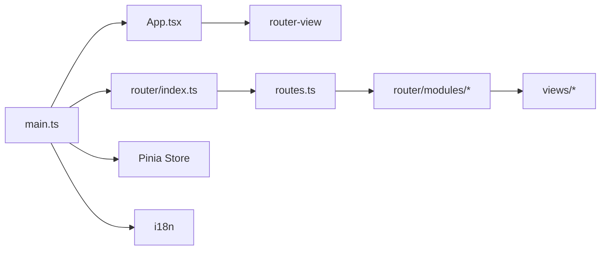

这种模式的作用：

- 页面切换主要在浏览器内完成，减少整页刷新。
- 前端可以独立管理路由、状态、主题、国际化等交互体验。
- 后端主要提供 REST API，不直接参与页面渲染。

### 2.2 组件化架构模式

前端页面由多个组件组合而成，公共组件放在 `components`，页面内局部组件放在各自业务目录的 `components` 子目录。

代表目录：

- `gyyun-ui/src/components`
- `gyyun-ui/src/views`
- `gyyun-ui/src/layouts`
- `gyyun-ui/src/views/**/components`

主要特征：

- `layouts/content` 提供登录后主框架、导航栏和内容区域。
- `views/*` 按业务页面组织，例如项目、资源、数据源、安全中心、监控等。
- 页面内复杂 UI 会继续拆成表格、弹窗、表单、图表、DAG 节点等组件。
- 公共组件如 `modal`、`monaco-editor` 放在 `src/components` 下复用。

组件依赖大致如下：

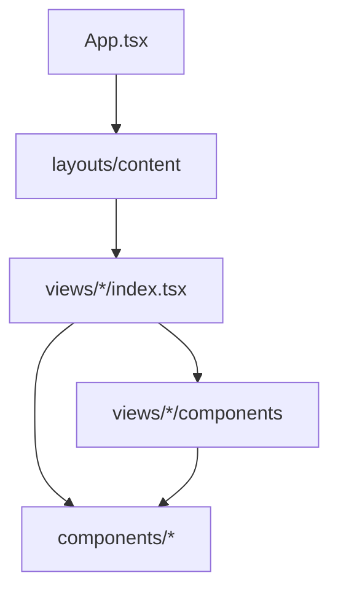

这种模式的作用：

- 让复杂页面按 UI 功能拆分，降低单个文件复杂度。
- 公共弹窗、编辑器、布局能力可以复用。
- 页面组件更关注展示结构，业务逻辑可以交给 `use-*` 文件。

### 2.3 Composition API + 业务 Hook 模式

项目中大量使用 `use-*` 文件拆分页面逻辑，这是一种基于 Vue Composition API 的组合式业务逻辑模式。

代表文件：

- `gyyun-ui/src/views/login/use-login.ts`
- `gyyun-ui/src/views/login/use-form.ts`
- `gyyun-ui/src/views/home/use-table.ts`
- `gyyun-ui/src/views/projects/**/use-table.ts`
- `gyyun-ui/src/views/projects/**/use-form.ts`
- `gyyun-ui/src/views/resource/**/use-create.ts`
- `gyyun-ui/src/views/resource/**/use-upload.ts`

主要特征：

- `index.tsx` 通常负责页面结构和组件组合。
- `use-table.ts` 负责表格列、查询、分页、数据刷新。
- `use-form.ts` 负责表单模型、校验规则、提交参数。
- `use-*` 可以复用 service、store、router、i18n、工具函数。

典型页面内部结构：

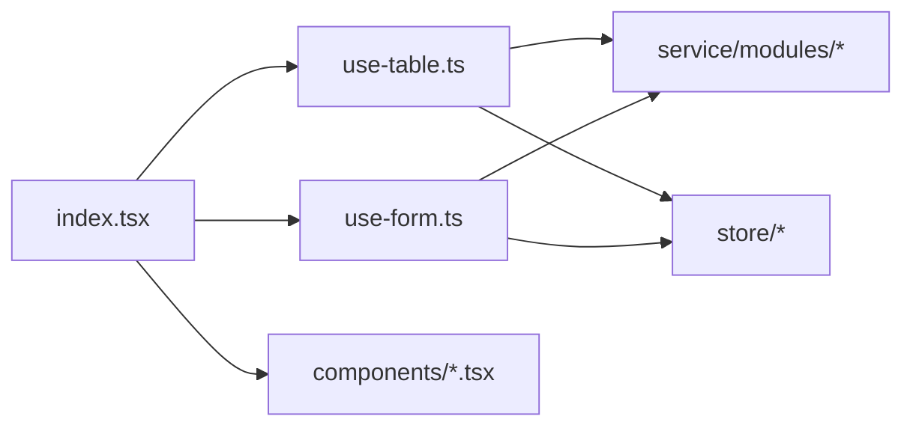

这种模式的作用：

- 避免页面组件承载过多业务逻辑。
- 表格、表单、弹窗等常见逻辑更容易维护。
- 业务逻辑可以按功能组合，而不是按继承层级组织。

### 2.4 MVVM 思想

前端整体也体现了 MVVM 思想，但不是传统意义上的单文件 MVVM 框架，而是 Vue 响应式体系下的分层落地。

对应关系：

| MVVM 角色 | 项目中的体现 | 主要功能 |
| --- | --- | --- |
| View | `views/*`、`components/*`、TSX 模板 | 展示页面、接收用户操作 |
| ViewModel | `use-*` hooks、Pinia store、组件 `setup` | 管理响应式状态、派生数据、事件处理 |
| Model | `service/modules/*` 的返回类型、Pinia state、后端 API 数据 | 承载业务数据和接口数据 |

这种模式的作用：

- UI 与状态通过 Vue 响应式系统自动同步。
- 页面无需手动操作 DOM。
- 业务状态变化后，相关组件自动重新渲染。

### 2.5 前端 Store 模式

项目使用 Pinia 做集中式状态管理，并通过持久化插件保留部分状态。

代表目录：

- `gyyun-ui/src/store/user`
- `gyyun-ui/src/store/project`
- `gyyun-ui/src/store/theme`
- `gyyun-ui/src/store/locales`
- `gyyun-ui/src/store/ui-setting`
- `gyyun-ui/src/store/timezone`

主要特征：

- `user` 保存登录态、会话、用户信息、安全配置。
- `project` 保存当前项目、任务类型、DAG 相关状态。
- `theme` 和 `locales` 控制主题和语言。
- `ui-setting` 控制 UI 设置与请求超时等配置。
- `pinia-plugin-persistedstate` 让部分状态在刷新后保留。

Store 与其他前端模块的关系：

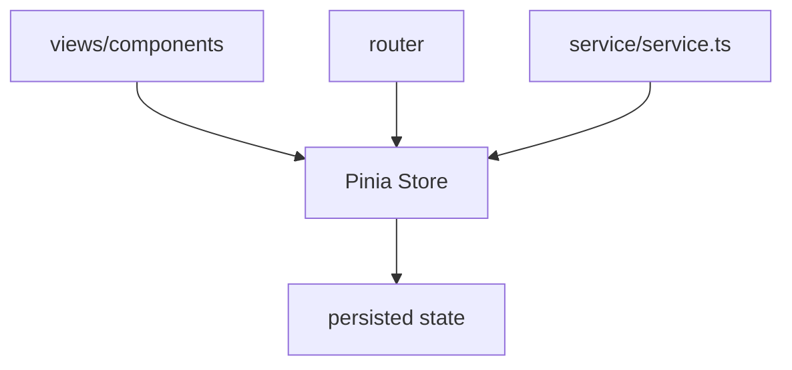

这种模式的作用：

- 登录态、主题、语言、项目上下文等跨页面状态集中管理。
- 避免多层组件反复传递通用状态。
- 请求层可以从 Store 中读取 sessionId 并处理登录失效。

### 2.6 API Client 分层模式

前端没有直接在页面中散落调用 `axios`，而是统一封装请求实例，并按业务模块组织 API。

代表文件：

- `gyyun-ui/src/service/service.ts`
- `gyyun-ui/src/service/modules/*/index.ts`
- `gyyun-ui/src/service/modules/*/types.ts`

主要特征：

- `service.ts` 创建统一 Axios 实例。
- 请求拦截器统一注入 `sessionId` 和语言信息。
- 响应拦截器统一处理响应码、错误提示、登录失效跳转。
- `service/modules` 按业务域拆分接口，例如项目、工作流、任务实例、资源、数据源、监控、安全等。

典型调用链：

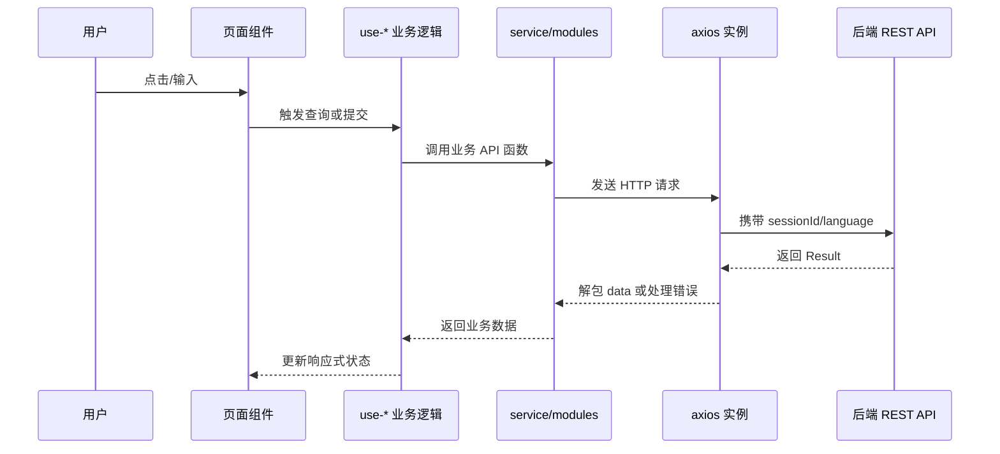

这种模式的作用：

- 页面不用关心请求头、序列化、错误码、登录过期等通用细节。
- 每个业务域的 API 更容易查找和维护。
- 前端和后端通过稳定的 REST 契约协作。

### 2.7 路由模块化模式

路由按业务域拆分，避免一个路由文件过大。

代表目录：

- `gyyun-ui/src/router/modules/projects.ts`
- `gyyun-ui/src/router/modules/resources.ts`
- `gyyun-ui/src/router/modules/datasource.ts`
- `gyyun-ui/src/router/modules/monitor.ts`
- `gyyun-ui/src/router/modules/security.ts`
- `gyyun-ui/src/router/modules/ui-setting.ts`

主要特征：

- `routes.ts` 聚合基础页面和业务路由模块。
- `import.meta.glob('/src/views/**/**.tsx')` 自动收集页面组件。
- 路由 `meta` 保存菜单、标题、权限等信息。
- `router.beforeEach` 处理前端路由守卫和进度条。

这种模式的作用：

- 新增业务页面时可以在对应路由模块维护。
- 页面组件和路由名之间建立统一映射。
- 菜单激活、权限判断、布局展示可通过路由元信息驱动。

### 2.8 前端插件化与动态 UI 思路

前端存在面向任务类型、UI 插件、DAG 节点和动态表单的扩展结构。

代表位置：

- `gyyun-ui/src/service/modules/ui-plugins`
- `gyyun-ui/src/service/modules/dynamic-dag`
- `gyyun-ui/src/store/project/task-type.ts`
- `gyyun-ui/src/views/projects/task/components/node`
- `gyyun-ui/public/images/task-icons`

主要特征：

- 不同任务类型有不同图标、表单字段和参数结构。
- DAG 编辑、任务节点配置、任务类型数据由前后端共同驱动。
- 前端通过动态数据和组件逻辑适配后端插件体系。

这种模式的作用：

- 当前端支持新增任务类型时，不必完全改造主流程。
- 任务节点编辑器可以按任务类型动态呈现字段。
- 与后端任务插件机制形成配套。

## 3. 后端架构模式

### 3.1 多进程分布式 Master-Worker 模式

后端核心运行角色分为 API Server、Master Server、Worker Server、Alert Server 等。其中 Master 和 Worker 是调度系统的关键角色。

代表模块：

- `gyyun-api`
- `gyyun-master`
- `gyyun-worker`
- `gyyun-alert`
- `gyyun-extract`
- `gyyun-registry`
- `gyyun-dao`
- `gyyun-service`

主要职责：

| 运行角色 | 代表入口 | 主要职责 |
| --- | --- | --- |
| API Server | `ApiApplicationServer` | 提供 REST API，处理登录、权限、项目、工作流、资源、数据源等管理请求 |
| Master Server | `MasterServer` | 拉取命令、调度工作流、维护 DAG 执行、任务分发、故障转移、状态机推进 |
| Worker Server | `WorkerServer` | 接收 Master 分发的任务，加载任务插件，执行物理任务，回报执行事件 |
| Alert Server | `gyyun-alert` | 处理告警事件和告警插件发送 |
| Registry | `gyyun-registry` | 节点注册、服务发现、高可用、分布式锁、事件订阅 |
| Metadata DB | `gyyun-dao` | 保存项目、工作流定义、实例、任务实例、命令、用户、资源元数据 |

后端运行关系：

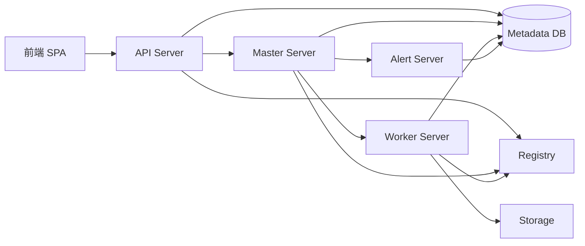

这种模式的作用：

- API、调度、执行、告警职责分离。
- Master 可以横向扩展并通过注册中心协调。
- Worker 可以按任务执行能力、资源、分组进行扩展。
- 调度状态落库，进程异常后可以通过 failover 恢复。

### 3.2 后端分层架构模式

API 管理类业务采用典型 Spring 分层结构。

代表目录：

- `gyyun-api/src/main/java/org/apache/gyyun/api/controller`
- `gyyun-api/src/main/java/org/apache/gyyun/api/service`
- `gyyun-api/src/main/java/org/apache/gyyun/api/service/impl`
- `gyyun-dao/src/main/java/org/apache/gyyun/dao/repository`
- `gyyun-dao/src/main/java/org/apache/gyyun/dao/mapper`
- `gyyun-dao/src/main/java/org/apache/gyyun/dao/entity`

典型调用链：

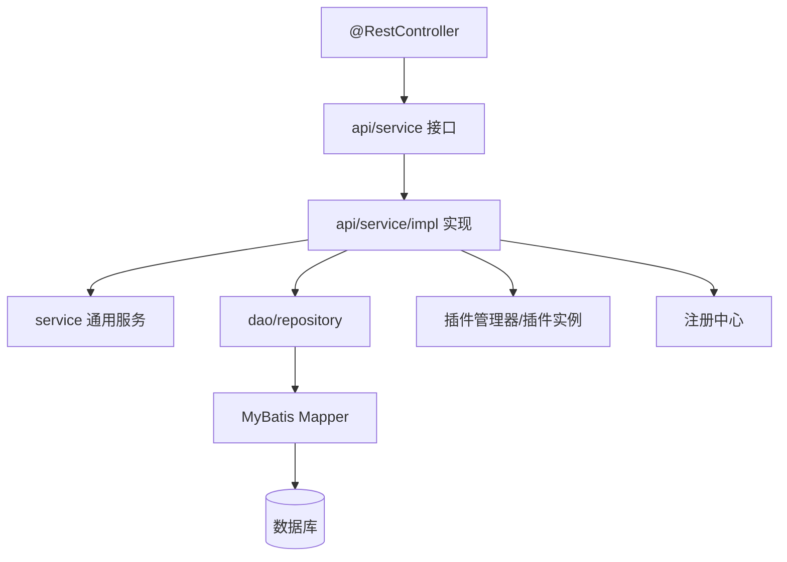

以工作流定义为例：

- `WorkflowDefinitionController` 接收 HTTP 请求。
- `WorkflowDefinitionService` 定义业务接口。
- `WorkflowDefinitionServiceImpl` 实现创建、更新、发布、复制、查询等业务规则。
- DAO Repository 和 Mapper 负责读取或写入工作流定义、任务定义、任务关系等数据。

这种模式的作用：

- Controller 只负责 HTTP 参数、登录用户、响应结果和审计注解。
- Service 负责业务规则和事务边界。
- Repository/Mapper 负责数据访问。
- Entity/DTO/VO 承载数据结构。

### 3.3 事件驱动架构模式

Master 和 Worker 内部大量通过事件总线推进状态变化，是后端调度引擎的核心模式之一。

代表位置：

- `gyyun-master/src/main/java/org/apache/gyyun/server/master/engine/WorkflowEventBus.java`
- `gyyun-master/src/main/java/org/apache/gyyun/server/master/engine/WorkflowEventBusFireWorker.java`
- `gyyun-master/src/main/java/org/apache/gyyun/server/master/engine/system/SystemEventBus.java`
- `gyyun-master/src/main/java/org/apache/gyyun/server/master/engine/task/lifecycle`
- `gyyun-worker/src/main/java/org/apache/gyyun/server/worker/executor/PhysicalTaskExecutorEventBusCoordinator.java`
- `gyyun-task-executor`

主要事件类型：

- 工作流生命周期事件。
- 任务生命周期事件。
- 系统事件，例如 Master failover、Worker failover。
- Worker 任务执行状态上报事件。

事件驱动链路：


这种模式的作用：

- 解耦调度流程中的状态变化、任务分发、回调处理。
- 支持异步推进工作流，减少同步阻塞。
- Failover、重试、暂停、停止等复杂状态更容易扩展。

### 3.4 命令模式

Master 使用命令机制表达一次调度意图，例如手动运行、定时调度、补数、重跑、恢复失败等。

代表位置：

- `gyyun-master/src/main/java/org/apache/gyyun/server/master/engine/command`
- `gyyun-master/src/main/java/org/apache/gyyun/server/master/engine/command/handler`
- `gyyun-common/src/main/java/org/apache/gyyun/common/enums/CommandType.java`
- `gyyun-dao/src/main/java/org/apache/gyyun/dao/entity/Command.java`
- `gyyun-dao/src/main/java/org/apache/gyyun/dao/repository/CommandDao.java`

主要特征：

- API 或调度器生成 `Command` 并写入数据库。
- `CommandEngine` 拉取待处理命令。
- 不同 `CommandType` 交给不同 `ICommandHandler` 处理。
- Handler 将命令转换为具体工作流触发行为。

命令处理链路：

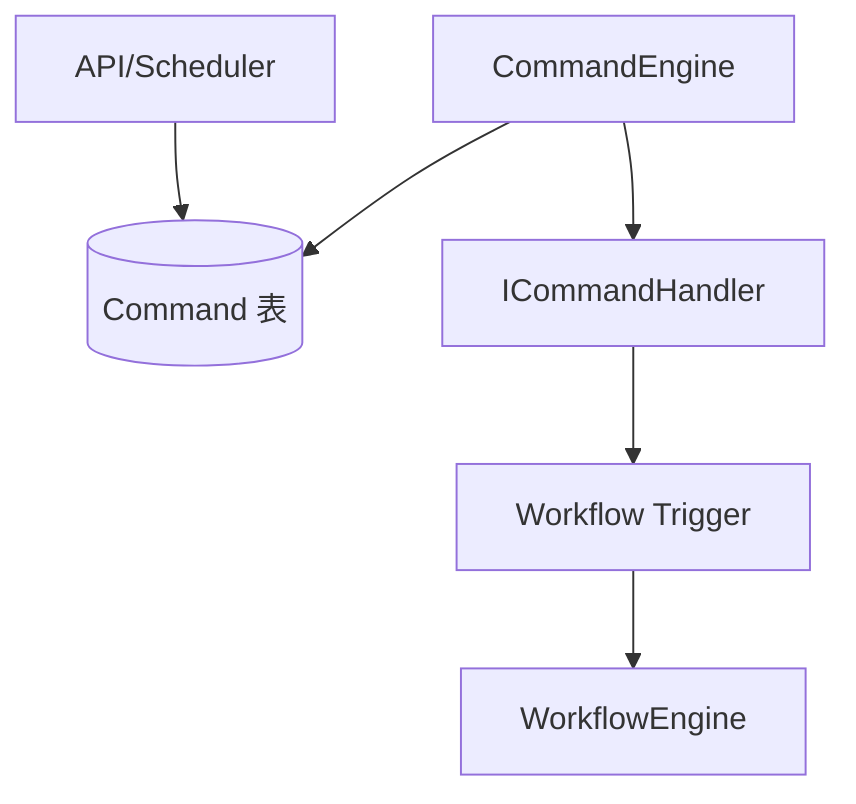

这种模式的作用：

- 把“用户或系统想做什么”抽象成命令。
- 各类调度入口可以复用统一处理流程。
- 命令落库后具备可恢复能力。

### 3.5 状态机模式

工作流和任务都有明确状态，并通过 StateAction 类处理不同状态下的行为。

代表位置：

- `gyyun-master/src/main/java/org/apache/gyyun/server/master/engine/workflow/statemachine`
- `gyyun-master/src/main/java/org/apache/gyyun/server/master/engine/task/statemachine`

主要特征：

- 工作流状态有 submitted、running、paused、success、failed、stopped、failover 等处理类。
- 任务状态有 submitted、dispatch、running、success、failure、pause、kill、retry 等处理类。
- Factory 根据当前状态选择对应 Action。

这种模式的作用：

- 把复杂的状态转移逻辑拆到不同 Action 中。
- 减少一个巨大 `if/else` 或 `switch` 承载所有状态逻辑。
- 调度流程在失败、重试、暂停、恢复等情况下更容易维护。

### 3.6 DAG 图执行模式

DolphinScheduler 的核心业务对象是工作流 DAG。Master 会根据任务定义和任务依赖关系构造执行图，再按拓扑和状态推进。

代表位置：

- `gyyun-master/src/main/java/org/apache/gyyun/server/master/engine/graph`
- `gyyun-master/src/main/java/org/apache/gyyun/server/master/engine/workflow/execution`
- `gyyun-service/src/main/java/org/apache/gyyun/service/process/WorkflowDag.java`
- `gyyun-service/src/main/java/org/apache/gyyun/service/utils/DagHelper.java`

主要特征：

- 工作流定义由任务节点和任务关系组成。
- `WorkflowGraph` 表示逻辑 DAG。
- `WorkflowExecutionGraph` 表示具体实例执行图。
- 调度时根据前置依赖、失败策略、条件节点、分支节点、子工作流等推进后续任务。

这种模式的作用：

- 非线性任务依赖可以被图模型表达。
- Master 可以判断哪些任务已满足运行条件。
- 条件分支、依赖任务、子工作流等特殊节点可以接入图执行流程。

### 3.7 RPC 契约接口模式

后端 Server 之间通过 `gyyun-extract` 定义 RPC 契约，具体实现位于 Master、Worker、Alert 等运行模块。

代表模块：

- `gyyun-extract/gyyun-extract-base`
- `gyyun-extract/gyyun-extract-master`
- `gyyun-extract/gyyun-extract-worker`
- `gyyun-extract/gyyun-extract-alert`
- `gyyun-master/src/main/java/org/apache/gyyun/server/master/rpc`
- `gyyun-worker/src/main/java/org/apache/gyyun/server/worker/rpc`

主要特征：

- `extract` 模块只放接口、请求响应对象和 RPC 基础设施。
- Master、Worker 模块提供具体 `rpc` 实现。
- `MasterRpcServer`、`WorkerRpcServer` 在启动时暴露 RPC 服务。
- 调用方依赖接口，而不是直接依赖对方实现类。

RPC 关系：

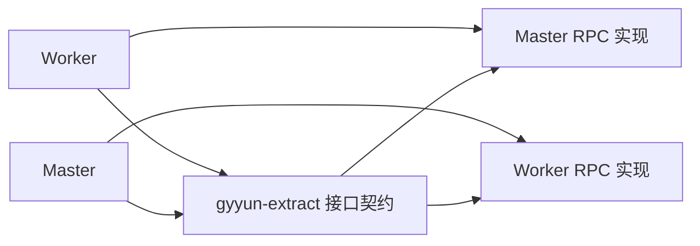

这种模式的作用：

- Server 之间通过稳定接口通信。
- RPC 实现和业务调用方解耦。
- Master/Worker 可作为独立进程部署。

### 3.8 注册中心与高可用模式

项目通过注册中心抽象实现服务注册、节点发现、监听、分布式锁和选主等能力。

代表模块：

- `gyyun-registry/gyyun-registry-api`
- `gyyun-registry/gyyun-registry-plugins`
- `gyyun-registry/gyyun-registry-all`
- `gyyun-master/src/main/java/org/apache/gyyun/server/master/registry`
- `gyyun-worker/src/main/java/org/apache/gyyun/server/worker/registry`
- `gyyun-master/src/main/java/org/apache/gyyun/server/master/cluster`
- `gyyun-master/src/main/java/org/apache/gyyun/server/master/failover`

主要特征：

- `Registry` 是统一抽象接口。
- Zookeeper、Etcd、JDBC 等实现作为插件接入。
- Master、Worker 启动时注册自身节点。
- Master 监听 Worker 节点变化，触发 failover 或负载调整。
- Master 集群通过 slot、订阅、锁等机制协调命令处理和故障恢复。

这种模式的作用：

- 支持多 Master 和多 Worker 部署。
- 节点上下线可以被感知。
- Worker 异常时 Master 可以重新接管任务。
- Master 异常时其他 Master 可以恢复工作流。

### 3.9 SPI 插件化架构模式

后端大量能力通过插件扩展，核心系统只依赖插件 API，不直接绑定具体实现。

代表插件模块：

- `gyyun-task-plugin`
- `gyyun-datasource-plugin`
- `gyyun-storage-plugin`
- `gyyun-alert`
- `gyyun-registry`
- `gyyun-authentication`
- `gyyun-dao-plugin`
- `gyyun-scheduler-plugin`

代表插件管理能力：

- `TaskPluginManager`
- `DataSourcePluginManager`
- `StorageConfiguration`
- 各插件 API 模块和具体实现模块。

插件架构关系：

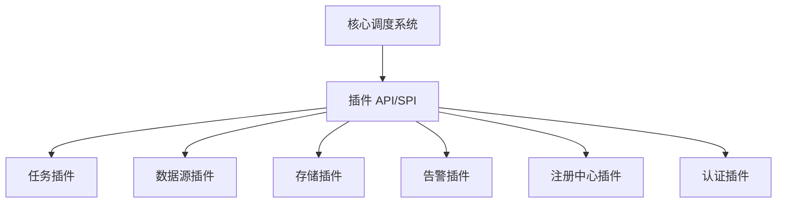

这种模式的作用：

- 新增任务类型时主要扩展任务插件。
- 新增数据源、存储、告警、注册中心实现时不需要改动核心调度流程。
- API Server、Master、Worker 启动时按需加载插件。
- 前端动态任务类型和 UI 插件机制可以与后端插件配合。

### 3.10 Repository + Mapper 数据访问模式

数据访问层采用 Repository/DAO 包装 MyBatis Mapper 的方式。

代表目录：

- `gyyun-dao/src/main/java/org/apache/gyyun/dao/repository`
- `gyyun-dao/src/main/java/org/apache/gyyun/dao/repository/impl`
- `gyyun-dao/src/main/java/org/apache/gyyun/dao/mapper`
- `gyyun-dao/src/main/java/org/apache/gyyun/dao/entity`

主要特征：

- Entity 与数据库表结构对应。
- Mapper 负责 SQL 映射和查询方法。
- Repository/DAO 封装更偏业务的数据访问操作。
- Service 层优先依赖 Repository/DAO，而不是到处直接写 SQL。

这种模式的作用：

- 业务层与具体 SQL 映射解耦。
- 重复数据访问逻辑集中维护。
- Mapper 保持相对低层，Repository 提供更稳定的数据访问语义。

### 3.11 策略模式与工厂模式

后端在调度、失败处理、负载均衡、插件创建、触发方式等位置使用了策略和工厂思想。

代表位置：

- `gyyun-master/src/main/java/org/apache/gyyun/server/master/cluster/loadbalancer`
- `gyyun-master/src/main/java/org/apache/gyyun/server/master/engine/workflow/policy`
- `gyyun-master/src/main/java/org/apache/gyyun/server/master/engine/workflow/trigger`
- `gyyun-master/src/main/java/org/apache/gyyun/server/master/engine/executor/plugin`
- `gyyun-service/src/main/java/org/apache/gyyun/service/cron/CycleFactory.java`

典型例子：

| 模式 | 项目体现 | 主要作用 |
| --- | --- | --- |
| 策略模式 | Worker 负载均衡策略 | 根据配置选择随机、轮询、加权等 Worker 选择逻辑 |
| 策略模式 | 工作流失败策略 | 决定任务失败后继续运行还是终止工作流 |
| 工厂模式 | WorkflowTrigger / LogicTaskPluginFactory | 根据命令类型、任务类型创建对应执行对象 |
| 工厂模式 | StateActionFactory | 根据当前状态选择状态处理器 |

这种模式的作用：

- 可替换算法不侵入主流程。
- 新增策略或处理器时改动范围较小。
- 调度引擎的扩展点更加明确。

### 3.12 横切关注点架构

后端通过 Spring 和自定义注解处理安全、审计、异常、指标等横切能力。

代表位置：

- `gyyun-api/src/main/java/org/apache/gyyun/api/security`
- `gyyun-api/src/main/java/org/apache/gyyun/api/audit`
- `gyyun-api/src/main/java/org/apache/gyyun/api/exceptions/ApiExceptionHandler.java`
- `gyyun-master/src/main/java/org/apache/gyyun/server/master/metrics`
- `gyyun-worker/src/main/java/org/apache/gyyun/server/worker/metrics`
- `gyyun-meter`

主要特征：

- Controller 使用注解表达审计行为。
- 全局异常处理统一转换 API 错误响应。
- Master、Worker、API 暴露运行指标。
- 安全模块处理登录态、认证方式、权限过滤。

这种模式的作用：

- 业务代码不需要重复写审计和异常包装逻辑。
- 运维监控能力与业务处理解耦。
- 认证和授权逻辑集中管理。

## 4. 前后端架构协作方式

前后端之间主要通过 REST API 协作，前端负责交互和状态展示，后端负责业务规则、调度执行和数据持久化。

典型业务链路：

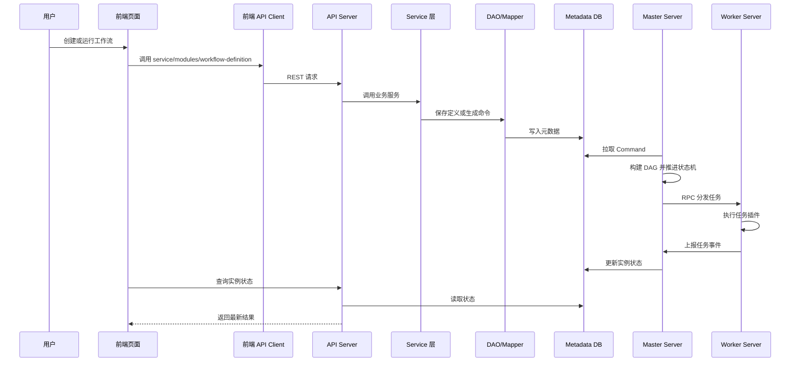

职责边界：

| 层次 | 前端职责 | 后端职责 |
| --- | --- | --- |
| 页面交互 | 表单、表格、DAG 编辑、主题、国际化 | 不负责页面渲染 |
| API 契约 | 调用 REST API，处理响应和错误 | 暴露 REST Controller，统一 Result 响应 |
| 业务规则 | 做必要的前端校验和交互限制 | 做最终权限、参数、状态、调度规则校验 |
| 状态展示 | 从 API 拉取实例、日志、监控数据并展示 | 维护元数据、运行状态、日志和指标 |
| 调度执行 | 不直接执行任务 | Master 编排，Worker 执行，Alert 告警 |

## 5. 架构模式速查表

### 5.1 前端模式速查

| 架构模式 | 代表位置 | 解决的问题 |
| --- | --- | --- |
| SPA 单页应用 | `main.ts`、`App.tsx`、`router` | 浏览器内完成页面切换和交互状态管理 |
| 组件化架构 | `components`、`views/**/components` | 复用 UI，拆分复杂页面 |
| Composition API Hook | `views/**/use-*.ts` | 将表格、表单、请求、弹窗逻辑从页面组件中抽离 |
| MVVM 思想 | Vue 响应式状态、TSX 渲染、Pinia | 状态变化驱动视图更新 |
| Store 模式 | `src/store/*` | 管理登录态、项目上下文、主题、语言等跨页面状态 |
| API Client 层 | `service/service.ts`、`service/modules/*` | 统一请求、错误处理、登录失效、业务 API 封装 |
| 路由模块化 | `router/modules/*` | 按业务域维护路由和菜单信息 |
| 动态 UI/插件思路 | `ui-plugins`、`dynamic-dag`、任务节点配置 | 配合后端插件体系支持多任务类型 |

### 5.2 后端模式速查

| 架构模式 | 代表位置 | 解决的问题 |
| --- | --- | --- |
| Master-Worker 分布式模式 | `gyyun-master`、`gyyun-worker` | 调度编排和任务执行分离，支持横向扩展 |
| Spring 分层架构 | `api/controller`、`api/service`、`dao` | API、业务、数据访问职责分离 |
| 事件驱动架构 | `WorkflowEventBus`、`SystemEventBus`、任务生命周期事件 | 异步推进工作流和任务状态 |
| 命令模式 | `CommandEngine`、`ICommandHandler`、`Command` | 将运行、调度、补数、重跑等意图统一抽象 |
| 状态机模式 | `workflow/statemachine`、`task/statemachine` | 管理复杂工作流和任务状态转移 |
| DAG 图执行模式 | `engine/graph`、`WorkflowExecutionGraph` | 表达任务依赖并按拓扑推进 |
| RPC 契约模式 | `gyyun-extract`、`server/*/rpc` | 解耦 Master、Worker、Alert 等进程间通信 |
| 注册中心 HA 模式 | `gyyun-registry`、`cluster`、`failover` | 服务发现、节点监听、分布式锁、故障恢复 |
| SPI 插件架构 | `task-plugin`、`datasource-plugin`、`storage-plugin`、`alert` | 扩展任务类型、数据源、存储、告警、注册中心等能力 |
| Repository/Mapper 模式 | `dao/repository`、`dao/mapper` | 业务数据访问和 SQL 映射分离 |
| 策略/工厂模式 | `loadbalancer`、`policy`、`trigger`、`plugin` | 支持算法和执行对象按配置或类型替换 |
| 横切关注点 | `security`、`audit`、`exceptions`、`metrics` | 统一认证、审计、异常和监控 |

## 6. 模块间依赖关系总结

### 6.1 前端依赖方向

```text
main.ts
  -> App.tsx
  -> router
  -> store
  -> locales

router
  -> router/modules
  -> layouts
  -> views

views
  -> components
  -> use-* hooks
  -> store
  -> service/modules
  -> utils/common/locales

service/modules
  -> service/service.ts
  -> types.ts

service/service.ts
  -> user store
  -> ui-setting store
  -> router
  -> utils
```

前端依赖方向总体是从页面到服务、从服务到统一请求实例、从页面和请求层读取 Store。公共能力被放在 `utils`、`common`、`locales`、`themes` 中。

### 6.2 后端依赖方向

```text
gyyun-api
  -> gyyun-service
  -> gyyun-dao
  -> gyyun-common
  -> gyyun-registry-api/all
  -> plugin api/manager

gyyun-master
  -> gyyun-service
  -> gyyun-dao
  -> gyyun-common
  -> gyyun-extract
  -> gyyun-registry
  -> gyyun-scheduler-plugin
  -> task/datasource/storage plugin

gyyun-worker
  -> gyyun-common
  -> gyyun-extract
  -> gyyun-registry
  -> task/datasource/storage plugin
  -> task-executor

gyyun-service
  -> gyyun-dao
  -> gyyun-common
  -> registry/storage/plugin api

gyyun-dao
  -> MyBatis Mapper
  -> Entity
  -> DB driver / dao plugin

gyyun-extract
  -> RPC contracts and transport

gyyun-registry
  -> registry api
  -> zookeeper / etcd / jdbc implementations

plugin modules
  -> plugin api
  -> concrete task/datasource/storage/alert/auth implementations
```

后端依赖方向总体是 Server 模块向下依赖公共能力和插件 API，插件实现依赖插件 API，`extract` 提供进程间通信契约，`registry` 提供分布式协调能力。

## 7. 如何按架构模式阅读源码

建议阅读顺序：

1. 先看前端入口：`src/main.ts`、`src/App.tsx`、`src/router/routes.ts`，理解 SPA 如何启动和切页。
2. 再选一个页面，例如项目列表或工作流定义，从 `views/**/index.tsx` 顺着 `use-*`、`service/modules/*` 读到请求层。
3. 看后端 API 入口：`ApiApplicationServer`、某个 `Controller`、对应 `Service`、`Repository`、`Mapper`。
4. 看 Master 启动入口：`MasterServer`，再读 `CommandEngine`、`WorkflowEngine`、`WorkflowEventBus`、`statemachine`。
5. 看 Worker 启动入口：`WorkerServer`，再读 `PhysicalTaskEngineDelegator`、`PhysicalTaskExecutor`、任务插件加载。
6. 看跨进程通信：`gyyun-extract` 和 Master/Worker 的 `rpc` 包。
7. 看扩展机制：任务插件、数据源插件、存储插件、注册中心插件。

按这个顺序阅读，能从“用户点击页面”一路串到“后端生成命令、Master 调度 DAG、Worker 执行任务、状态返回前端”。
